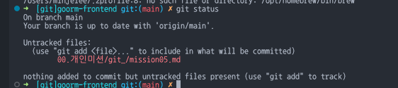

# (Git) README 파일 작성하고 커밋하기

- README 파일은 프로젝트의 개요와 사용법 등을 설명하는 문서입니다. 프로젝트 폴더에 README 파일을 작성하고, git status와 git log 명령어를 사용해 README 파일의 상태와 커밋 내역을 확인하며 커밋 과정을 학습합니다.

## 1. mission05.md 파일 작성

현재 파일!

## 2. 상태 확인


mission05.md가 "untracked" 상태로 표시되는 걸 확인

## 3. 스테이징 후 커밋

```bash
git add mission05.md
git commit -m "[git] 개인미션 5번"
```
