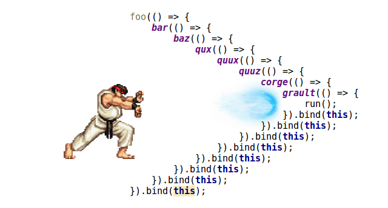

# 콜백, Promise, async/await란 무엇이며, 어떤 상황에서, 왜 사용하는가?

### 📌 비동기(Asynchronous)란?

- 프로그램이 위에서 아래로 순서대로 실행되지 않고, 기다려야 하는 작업이 있다면 그 작업을 기다리지 않고 다음 코드를 먼저 실행하는 방식
- 예: 서버 요청, 타이머, 파일 읽기, 사용자 입력 등

  → 자바스크립트는 싱글 스레드 언어이기 때문에, 멈추지 않고 계속 동작하려면 이런 비동기 처리가 꼭 필요함

  > 무언가를 주문하면 기다리는 동안 다른 일을 하는 것처럼, JS도 기다리는 동안 다른 코드를 실행할 수 있다.

## ✅ 콜백 함수 (Callback)

> ❓ 콜백 함수란?
> <b>나중에 호출할 함수</b>로, 다른 함수의 인자로 전달되어, 해당 함수의 실행이 끝난 뒤 호출되는 함수이다.

```javascript
function makeCoffee(callback) {
  console.log('1. 커피 주문 완료!');
  setTimeout(() => {
    console.log('2. 커피 제조 완료!');
    callback();
  }, 3000);

  makeCoffee(() => console.log('3. 커피 받으러 가요~'));
}
```

- `setTimeout`은 3초 뒤에 실행되는 함수(비동기 함수)
- 그 안에서 커피가 준비된 뒤 콜백 함수(`callback()`)를 실행함.

✔ 콜백을 사용하는 이유

- 비동기 작업 이후 실행할 코드를 작성하기 위해서 사용한다.
- 예: `setTimeout`, `addEventListener`, 서버 요청 후 처리 등

### ⚠️ 콜백 지옥 (Callback Hell)이란?

> 콜백 함수가 중첩에서 중첩으로 거듭하여 코드가 들여쓰기 지옥처럼 깊어지고, 가독성과 유지보수성이 매우 나빠지는 현상

```javascript
login(use, (userInfo) => {
  gerProfile(userInfo, (profile) => {
    getPosts(profile, (posts) => {
      renderPosts(posts, () => {
        console.log('게시글 렌더링 완료..~');
      });
    });
  });
});
```

- 하나의 콜백 안에 또 콜백,, 또,,,,
- 에러 처리도 어렵고, 중간 흐름을 파악하기 어려움



#### 문제점

- 코드가 우측으로 점점 밀림 = 피라미드 구조
- 유지보수가 어렵고, 디버깅이 복잡해짐
- 중간에서 실패했을 때 에러 처리가 힘듦

#### 해결방법

뒤에 나오는 개념들 사용하기!

- Promise는 `.then()` 체이닝을 통해 순서를 깔끔하게 표현할 수 있음.
- async/await은 동기 코드처럼 보이게 만들어 가독성을 높여줌

```javascript
// 같은 코드 promise 예시
login(user)
  .then(getProfile)
  .then(getPosts)
  .then(renderPosts)
  .then(() => {
    console.log('게시글 렌더링 완료!');
  })
  .catch((err) => {
    console.error('에러 발생:', err);
  });
```

## ✅ Promise

콜백 함수는 중첩이 많아지면 <b>콜백 지옥(callback hell)</b>이라는 문제가 생기므로, 이를 해결하기 위해 Promise가 등장했다.

> ❓ Promise란?
> 비동기의 작업의 성공 혹은 실패를 미래에 알려주겠다고 약속하는 객체
> 비동기 작업이 성공하면 `.then()`, 실패하면 `.catch()`로 처리

```javascript
const makeCoffee = new Promise((resolve, reject) => {
  setTimeout(() => {
    resolve('2. 커피 제조 완료!');
    // 또는 reject('에러 발생!');
  }, 3000);
});

makeCoffee
  .then((result) => {
    console.log(result); // 2. 커피 제조 완료!
    console.log('3. 커피 받으러 가요~');
  })
  .catch((err) => console.log('에러: 커피 제조 실페', err));
```

- `resolve()`는 작업이 성공했을 때 실행됨
- `reject()`는 작업이 실패했을 때 실행됨
- `.then()`은 성공 시 실행되는 콜백
- `.catch()`는 실패 시 실행되는 콜백

## ✅ async/await

> ❓ async/await란?
> Promise 기반 비동기 코드를 동기 코드처럼 깔끔하게 작성해주는 분법

```javascript
function makeCoffee() {
  return new Promise((resolve) => {
    setTimeout(() => resolve('커피 완료!'), 3000);
  });
}

async function orderCoffee() {
  console.log('1. 커피 주문!');
  const result = await makeCoffee(); // 여기서 기다림
  console.log('2.', result);
  console.log('3. 커피 받으러 감!');
}

orderCoffee();
```

- `async` 키워드가 붙은 함수 안에서만 `await`을 사용할 수 있음
- `await`은 Promise가 끝날 때까지 기다렸다가 다음 줄로 넘어감
- 코드의 흐름이 직관적이라 읽기 쉽고 유지보수가 쉬움

## ✅ 비교 요약

| 구분      | 콜백 함수                                        | Promise                                                  | async/await                                    |
| --------- | ------------------------------------------------ | -------------------------------------------------------- | ---------------------------------------------- |
| 개념      | 함수에 넘겨지는 함수                             | 미래에 성공/실패 결과를 담는 객체                        | Promise를 동기 코드처럼 깔끔하게 작성하는 문법 |
| 장점      | 간단한 작업에는 가볍고 빠르게 적용 가능          | 동기식처럼 읽기 쉬움                                     | 가독성 좋고 직관적임                           |
| 단점      | 중첩이 깊어지면 코드가 매우 복잡해짐 = 콜백 지옥 | `.then().catch()` 체인이 필요하며, 체인이 깊어질 수 있음 | `async` 함수 내에서만 `await` 사용 가능        |
| 사용 예시 | `setTimeout`, 이벤트 리스너 등                   | API 요청, 파일 읽기                                      | 대부분의 최신 비동기 코드                      |

## 🎯 실제 사용 시기

| 언제 사용?                         | 왜 사용?                                 |
| ---------------------------------- | ---------------------------------------- |
| 서버에 데이터 요청할 때            | 응답을 기다리되 UI는 멈추지 않게 하려고  |
| 파일 업로드/다운로드, DB 작업 등   | 시간이 오래 걸리기 때문                  |
| 사용자 입력 대기 또는 알림 처리 등 | 특정 작업 이후 실행되는 처리가 필요할 때 |

## 마무리!

콜백 함수는 비동기 함수를 순차적으로 실행하기 위한 일종의 편법같은 것(순서를 끼워 맞춤)이지, 비동기 전용 함수가 아니다.
여러 비동기 작업을 콜백 함수로 중첩하여 처리할 때 콜백 지옥(callback hell)이 발생함.
=> Promise 객체의 등장으로 콜백 지옥 해결!
하지만 then 메서드 체이닝이 계속됨
=> async/await
