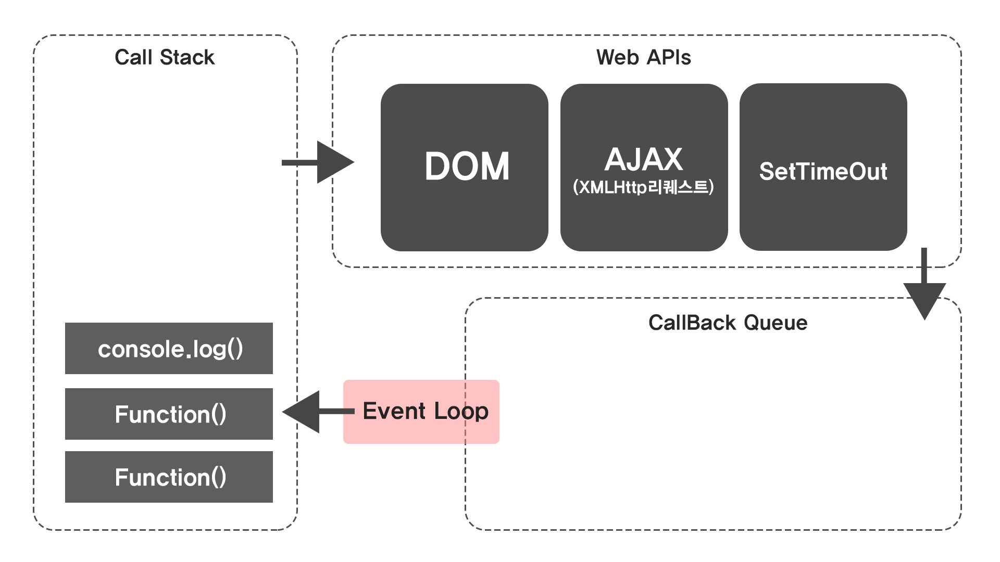

# 💡 스레드(Thread)란?

> 프로그램이 실행되는 가장 작은 단위의 흐름

### ❓자바스크립트가 멀티스테드처럼 보이는 이유

- 자바스크립트 엔진은 싱글 스레드이지만, 브라우저나 Node.js가 뒤에서 도와주는 비서(Web API, 백그라운드 스레드) 가 있어서, 비동기 작업들을 대신 처리하고 완료되면 "다 끝났어!" 하고 알려준다.
- 이벤트 루프(`Event Loop`)가 `Call Stack`이 비면 `Task Queue`에서 작업을 가져와 실행한다.

### ❓ Web API

- 브라우저에서 제공하는 비동기 기능(`setTimeout`, `fetch`, `DOM 이벤트` 등)

### ❓ 백그라운드 스레드

- Web API에 의해 실제로 비동기 작업을 처리하는 별도 스레드(진짜 일꾼!)

자바스크립트 엔진은 작업이 끝나면 콜백 함수만 받는다. 실행은 다시 싱글 스레드(`Call Stack`)에서 진행된다.

<br />
<br />
<br />

# 💡 자바스크립트는 멀티 스레드인가?

> 자바스크립트는 기본적으로 싱글 스레드 언어이다. 즉, 한 번에 하나의 `Call Stack`만 처리한다.

### ❓싱글스레드란?

- 한 번에 하나의 `Call Stack`만 실행한다는 의미
- 동시에 여러 개의 코드를 처리하지 않고, 하나씩 순서대로 처리한다.

<br />
<br />
<br />



# 💡 콜 스택(Call Stack)

> "해야 할 일 목록" 쌓아두는 박스

- 함수가 실행되는 순서를 관리하는 스택
- 가장 마지막에 들어간 함수가 가장 먼저 실행이 끝나는 구조 (LIFO)

```javascript
function one() {
  console.log('one');
  two();
}

function two() {
  console.log('two');
}

one();
```

1. `one()` 실행 → `Call Stack`에 `push`
2. `two()` 실행 → `Call Stack`에 `push`
3. `console.log("two")` 실행 후 → 제거(`pop`)
4. `console.log("one")` 실행 후 → 제거(`pop`)

<br />
<br />
<br />

# 💡 Web API (브라우저 제공 비동기 API)

자바스크립트 엔진에 없는 기능으로, 비동기 처리(`setTimeout`, `fetch` 등) 브라우저가 대신 실행해준다.<br/>
실행 완료 후, 콜백을 `Task Queue`나 `Microtask Queue`에 넣는다.<br/>
(비동기 작업은 Web API 영역의 백그라운드 스레드에서 실행된다!)

<br />
<br />
<br />

# 💡 Task Queue

- 비동기 작업이 끝난 후 실행할 콜백 함수들이 대기하는 큐
- `Call Stack`이 비어있으면 `Event Loop`가 이 큐에서 함수를 꺼내 실행한다. 주로, `Promise.then`, `async/await` 같은 작업이 이 줄에 서있다.

<br />
<br />
<br />

# 💡 Microtask Queue

- `Task Queue`보다 우선순위가 높음(`Stack`이 비면 `Microtask Queue`부터 실행)
- `Promise.then`, `MutationObserver` 등 마이크로태스크 콜백이 대기하는 큐

<br />
<br />
<br />

# 💡 Event Loop

`Call Stack`, `Web API`, `Task Queue`, `Microtask Queue` 사이에서 작업을 조율하는 반복 구조이다.

```javascript
console.log('A');

setTimeout(() => console.log('B'), 0);

Promise.resolve().then(() => console.log('C'));

console.log('D');
```

1. Stack: `A` 출력
2. `setTimeout` → Web API → Task Queue
3. `Promise.then` → Microtask Queue
4. Stack: `D` 출력
5. Stack이 비면 → Microtask Queue(`C`)
6. 그 후 Task Queue(`B`)

출력 결과:` A → D → C → B`

## ▶️ 이벤트 루프 강의 퀴즈 정리

- Call Stack: 현재 실행 중인 함수들이 쌓이는 공간
- setTimeout은 Web API 영역에서 대기
- 이벤트 루프: Call Stack이 비면 Task Queue에서 작업을 꺼낸다
- 콜백 함수들이 대기하는 곳: Task Queue
- 자바스크립트는 싱글 스레드인데 동시에 여러 작업 가능 이유: Web API + 이벤트 루프 구조

<br />
<br />
<br />

# ⚠️ `Web Worker`와 `worker_threads`는 왜 나왔을까?

자바스크립트 엔진은 기본적으로 싱글 스레드로 한 번에 한 작업만 처리할 수 있음.<br />
비동기 작업은 Web API 덕분에 동시에 처리되는 것처럼 보이지만, 메인 스레드에서 실행되는 계산이 너무 무거우면 `Call Stack`이 점유되어 화면이 멈추거나 이벤트가 무시되는 문제가 생김.<br />
그래서 별도의 스레드에서 CPU 연산을 처리할 수 있는 해결책이 나왔는데, 그게 `Web Worker`와 `worker_threads`.

## `Web Worker`란?

브라우저에서 제공하는 멀티 스레드 기능으로, 별도의 스레드(`Worker`)에서 자바스크립트 코드를 실행할 수 있다.

- 메인 스레드(UI)와 분리되어 별도의 스레드에서 자바스크립트를 실행
- 메모리를 직접 공유하지 않고, 메시지 기반으로 통신
- DOM 접근 불가능(UI 조작은 메인스레드에서만 가능!)

```javascript
// main.js
const worker = new Worker('worker.js');
worker.postMessage('시작!');
worker.onmessage = (e) => console.log('결과:', e.data);
```

```javascript
// worker.js
self.onmessage = (e) => {
  let sum = 0;
  for (let i = 0; i < 1_000_000_000; i++) sum += i;
  postMessage(sum);
};
```

무거운 연산은 `worker.js`에서 처리되고, 메인 스레드는 멈추지 않고 계속 UI를 처리한다.

## `worker_threads`란?

Node.js에서 멀티 스레드를 쓰고 싶을 때 사용하는 모듈로, 무거운 연산(예: 이미지 처리, 대용량 데이터 연산)을 메인 스레드와 분리해서 병렬 처리할 수 있다.<br />
`Web Workers`와 비슷하게, 메모리를 공유하지 않고 메시지 기반으로 동작하여, 데이터 충돌을 방지한다.

```javascript
// main.js
const { Worker } = require('worker_threads');

const worker = new Worker('./worker.js');
worker.postMessage('시작!');
worker.on('message', (msg) => {
  console.log('결과:', msg);
});
```

```javascript
// worker.js
const { parentPort } = require('worker_threads');

parentPort.on('message', () => {
  let sum = 0;
  for (let i = 0; i < 1_000_000_000; i++) sum += i;
  parentPort.postMessage(sum);
});
```

<br />
<br />
<br />

# 💡 자바스크립트 스코프

> 스코프(Scope)란 변수에 접근할 수 있는 범위를 의미한다.

| 종류                      | 설명                               |
| ------------------------- | ---------------------------------- |
| 전역 스코프(Global Scope) | 어디서든 접근 가능한 범위          |
| 지역 스코프(Local Scope)  | 함수나 블록 내부에서만 유효한 범위 |

```javascript
let globalVar = '전역';

function example() {
  let localVar = '지역';
  console.log(globalVar); // 접근 가능
  console.log(localVar); // 접근 가능
}

console.log(globalVar); // 접근 가능
console.log(localVar); // 접근 불가 - 오류(스코프 밖)
```

<br />
<br />
<br />

# 💡 실행 컨텍스트(Execution Context)

코드 실행에 필요한 정보를 담고 있는 객체로, 함수가 실행될 때 `Call Stack`에 쌓이고, 스코프, `this`, 변수, 함수 선언 정보를 포함한다.

<br />
<br />
<br />

# 💡 렉시컬 환경(Lexical Environment)

> 함수가 정의될 때, 그 함수가 접근할 수 있는 변수˙함수 범위(스코프)를 기억하는 구조
>
> - Lexical(렉시컬): 코드가 작성된 위치(`어디서 정의되었는가`)
> - Environment(환경): 식별자(변수, 함수 선언)가 저장된 공간
>   즉, 어떤 함수나 블록이 `어디서 정의되었는지`에 따라 변수 접근 범위가 결정되는 것

## 특징

- 호출 위치가 아닌 정의된 위치가 기준(호출 위치❌)
- 클로저가 동작할 수 있는 이유

```javascript
function outer() {
  let count = 0;
  return function inner() {
    count++;
    console.log(count);
  };
}

const counter = outer();
counter(); // 1
counter(); // 2
```

1. `outer()` 실행 → `count = 0`, `inner` 함수 반환
2. `const counter = inner` 함수
3. `counter()` 실행 시, `inner`가 `count`를 증가시키고 출력

### ❓ 왜 함수가 끝나도 변수가 남아있을까?

- 함수 객체에는 `[[Environment]]`라는 숨겨진 프로퍼티(참조)가 있어서, 정의될 당시의 렉시컬 환경을 계속 기억하기 때문.
- 이 참고가 남아있는 한, Garbage Collector가 변수를 지우지 않음.(=메모리를 해제하지 않음)

### ❓`[[Environment]]`는 뭔데?

- 함수 객체가 내부적으로 자신이 정의될 당시의 외부 환경을 기억하기 위해 갖는 숨겨진 참조
- JS 엔진 내부에 있는 값이라 콘솔에서는 직접 볼 수는 없다.

### ❓Garbage Collector란?

더 이상 참조되지 않는 메모리를 자동으로 해제해주는 기능

### ❓return이 렉시컬 환경을 만드는가?

아니다.

- 렉시컬 환경은 함수가 정의될 때 이미 생김.
- `return`은 단지 내부 함수를 외부로 전달해서 그 환경을 외부에서도 접근 가능하게 할 뿐.
- `return` 없이도 렉시컬 환경은 존재하고 클로저도 가능.

<br />
<br />
<br />

# 💡 클로저(Closure)

> 함수가 생성될 당시의 외부 변수를 기억하고, 그 함수가 살아있는 동안 그 변수에 접근할 수 있게 하는 기능

```javascript
function outer() {
  let count = 0;
  return function inner() {
    count++;
    console.log(count);
  };
}

const counter = outer();
counter(); // 1
counter(); // 2
```

- `inner`가 `outer`의 변수 `count`를 기억 → 실행 끝나도 `count`는 살아있음.

1. `outer()` 실행 → `count = 0`
2. `inner` 함수 변환(`counter` 변수에 저장)
3. `counter()` 실행 → `count` 값 유지/증가

### ❓ 왜 outer()가 끝났는데 count가 살아있을까?

- `inner` 함수는 **outer의 렉시컬 환경(Lexical Environment)** 을 기억하고 있기 때문에, GC가 변수(`count`)를 지우지 않는다.
- **GC(가비지 컬렉터)** 가 `count`를 지우지 않는 이유: `inner` 함수가 여전히 참조 중이기 때문.

## ▶️ 특징

- 데이터 은닉(Encapsulation): `count` 변수는 `outer` 함수 바깥에서는 접근할 수 없음
- 상태 유지: `outer()`가 한 번만 실행되어도, `inner`는 `count` 값을 계속 유지하고 변경 가능

## ▶️ return 없어도 클로저는 발생

### (1) 이벤트 핸들러 안에서 클로저

```javascript
function setup() {
  let count = 0;
  document.body.addEventListener('click', function () {
    count++;
    console.log(count);
  });
}
setup();
```

- `setup()`은 return을 하지 않지만,
- 이벤트 리스너(내부 익명 함수)는 `count` 변수를 계속 참조함.
- `setup()` 함수 실행이 끝나도, **이 핸들러 함수가 살아있는 동안 count도 메모리에 남아있습니다.**

### (2) setInterval 안에서 클로저

```javascript
function startTimer() {
  let sec = 0;
  setInterval(function () {
    sec++;
    console.log(sec);
  }, 1000);
}
startTimer();
```

- `setInterval`에 넘긴 함수가 **외부 변수 sec을 참조**함.
- `startTimer()` 함수 실행이 끝나도 `sec`이 계속 살아있고, 클로저로 접근 가능함.

### (3) 내부 호출

```javascript
function outer() {
  let msg = 'Hello';
  function inner() {
    console.log(msg);
  }
  inner();
}
outer();
```

- 이 경우에는 **outer 실행이 끝나기 전**이지만, inner가 외부 스코프의 msg를 참조함.
- return은 필요하지 않음.

## ▶️ 렉시컬 환경 vs 클로저

| 구분        | 렉시컬 환경         | 클로저                                            |
| ----------- | ------------------- | ------------------------------------------------- |
| 정의시점    | 함수 정의 시        | 내부 함수가 외부 변수를 참조할 때                 |
| 역할        | 변수 접근 범위 결정 | 외부 함수 실행이 끝나도 변수를 유지               |
| return 필요 | 없음                | return 없이도 가능하지만 return 시 외부 접근 가능 |

- 렉시컬 환경: 함수가 정의될 때 결정되는 "변수를 어디서 찾을지"에 대한 정보(=변수 검색 범위)
- 클로저: 정의될 때 기억한 렉시컬 환경을 실행이 끝난 뒤에도 기억해서 사용하는 것
- return: 클로저를 밖에서도 계속 쓸 수 있게 만드는 도구일 뿐, 본질은 아님

<br />
<br />
<br />

# 💡 prototype과 객체 생성 방식 비교

## ▶️ `prototype` 이란?

- 모든 함수에 기본적으로 있는 속성
- `new`로 객체를 만들 때, 모든 인스턴스가 공유하는 부모 객체 역할(`new`로 만든 객체는 `__proto__`를 통해 생성자의 `prototype`에 연결)
- 메서드를 한 곳(`prototype`)에 정의하면 메모리를 절약할 수 있다.

### ❓`function.prototype`

- 함수에 붙어 있는 속성으로, 생성된 객체의 부모가 된다.

### ❓ `__proto__` 이건 뭔데?

- 객체가 참조하는 `prototype` 링크(실제 표준 이름은 `[[Prototype]]`)
- `prototype` 체인을 따라 메서드나 속성을 찾는 연결고리 역할

### Window 객체 예시


- `alert`는 `window` 객체에 정의된 함수
- `window.alert = 'a'`로 재정의하면 `alert()`을 함수로 쓸 수 없게 되는 걸 확인
- 전역 객체(`window`)와 속성/메서드 구조를 이해함

### ❓왜 `prototype`을 사용할까?

1. 메모리 절약
   - 같은 메서드를 여러 객체가 공유하므로, 매번 새로운 함수를 만들지 않아도 된다.
2. 공유/상속 구조
   - 모든 인스턴스가 동일한 동작을 공유할 때 유리하다.

## ▶️ (1) 생성자 함수 + prototype

```javascript
function Person(name) {
  this.name = name;
}
Person.prototype.sayHi = function () {
  console.log(`안녕, 나는 ${this.name}`);
};
const p1 = new Person('민제');
p1.sayHi(); // 안녕, 나는 민제
```

### ❓ 왜 메서드를 `prototype`에 넣나?

모든 인스턴스가 같은 메서드를 공유하기 위해(메모리 효율)

### ❓ 생성자 함수란?

`new` 키워드와 함께 호출되어 새로운 객체를 만들어주는 함수

## ▶️ (2) 팩토리 함수(Factory Function)

```javascript
const personObject = (name) => ({
  sayHi: () => console.log(`안녕, 나는 ${name}`),
});
personObject('민제').sayHi();
```

- `new` 없이 객체를 반환
- 클로저를 사용해 `name`을 기억
- 단점: 공유가 없어서 매번 새 메서드가 생김(상대적으로 메모리 효율 하락)
