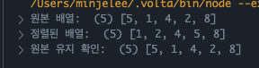
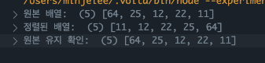
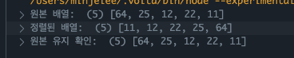
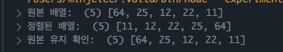
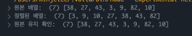

# 정렬 알고리즘

무언가를 찾는 행위, 즉 탐색 알고리즘을 만들 때는 정렬 알고리즘이 선행이 되어야 좋다

## O(n²) 정렬 3형제

[참고하면 좋은 시각화 자료](https://bluewings.github.io/sorting-algorithms-at-a-glance/)

### 버블 정렬

> 옆에 있는 값과 비교해 큰 값을 뒤로 "밀어내는" 방식

- 장점: 직관적이고 구현이 쉽다.
- 단점: 비교/교환이 많아 매우 느리다.

```javascript
// 시간복잡도: 최악 O(n²), 최선 O(n) (이미 정렬된 경우 swapped 최적화 덕분에 한 번만 돈다).
// 공간복잡도: O(n) (여기서는 원본 보존 때문에 배열 복사 사용).

function bubbleSort(arr) {
  // 1. 원본 배열 복사하여 새로운 배열을 만든다.
  const a = arr.slice();

  // 2. 배열을 여러 번 훑으면서 정렬 과정을 반복하며, swapped로 요소의 교환이 일어났는지 기록
  // 한 번도 교환이 안 일어나면 배열이 이미 정렬된 상태이므로 반복을 멈춤
  for (let i = 0; i < a.length - 1; i++) {
    let swapped = false; // 불필요한 반복을 줄이기 위해 사용(최적화 포인트)

    // 3. 인접 비교 - 인접한 두 원소 비교 후 앞이 크면 자리 교환
    for (let j = 0; j < a.length - 1 - i; j++) {
      if (a[j] > a[j + 1]) {
        // j와 j+1을 비교해서 앞이 크면
        [a[j], a[j + 1]] = [a[j + 1], a[j]]; // 배열 구조 분해 할당으로 서로 교환
        swapped = true;
      }
    }
    // 4. 교환 없으면 이미 정렬 끝났으니 중단
    if (!swapped) break;
  }
  return a;
}

const numbers = [5, 1, 4, 2, 8];

console.log('원본 배열: ', numbers);
const sorted = bubbleSort(numbers);
console.log('정렬된 배열: ', sorted);
console.log('원본 유지 확인: ', numbers);
```



### 선택 정렬

> 남은 구간에서 최솟값을 찾아 맨 앞으로 가져온다

- 장점: 교환 횟수는 적다
- 단점: 안정 정렬이 아니고, 비교 횟수는 없다

```javascript
function selectionSort(arr) {
  const a = arr.slice();

  // i는 현재 정렬해야 할 위치를 가리킴
  for (let i = 0; i < a.length; i++) {
    // 현재 구간에서 최소 인덱스 기록
    let min = i;

    // i 이후 구간에서 최솟값 탐색
    for (let j = i + 1; j < a.length; j++) {
      // < 대신 >로 조건만 바꾸면 내림차순도 가능
      if (a[j] < a[min]) min = j;
    }

    // 참은 최솟값과 i 위치 교환 = 스왑
    if (min !== i) {
      [a[i], a[min]] = [a[min], a[i]];
    }
  }
  return a;
}

const numbers = [64, 25, 12, 22, 11];

console.log('원본 배열: ', numbers);
const sorted = selectionSort(numbers);
console.log('정렬된 배열: ', sorted);
console.log('원본 유지 확인: ', numbers);
```



### 삽입 정렬

> 이미 정렬된 구간에 새로운 원소를 끼워 넣는다

- 장점: 안전 정렬, 거의 정렬된 배열에서 빠르다.
- 단점: 큰 데이터에서는 여전히 O(n²).

```javascript
function insertionSort(arr) {
  const a = arr.slice();

  // i=1부터 시작한다. (0번째 원소는 이미 "정렬된 구간"이라 가정)
  for (let i = 1; i < a.length; i++) {
    // key는 이번에 정렬된 구간에 삽입할 값
    const key = a[i];
    // j는 key 앞쪽의 정렬된 원소들을 가리킴
    let j = i - 1;

    // a[j]가 key보다 크면 오른쪽으로 한 칸씩 밀어낸다.
    while (j >= 0 && a[j] > key) {
      a[j + 1] = a[j];
      // j-- 하면서 왼쪽으로 이동하며 적절한 위치를 찾는다.
      j--;
    }

    // 반복문이 끝난 위치(j+1)에 key를 삽입
    a[j + 1] = key;
  }
  return a;
}

const numbers = [64, 25, 12, 22, 11];

console.log('원본 배열: ', numbers);
const sorted = insertionSort(numbers);
console.log('정렬된 배열: ', sorted);
console.log('원본 유지 확인: ', numbers);
```



## O(n log n) 정렬 — 분할 정복 패턴

> 큰 문제 → 쪼개서 → 각각 풀고 → 합쳐서 해결

### 퀵 정렬

> 피벗을 기준으로 작은 값/큰 값 그룹으로 나누고 재귀적으로 정렬

- 평균 O(n log n)
- 추가 메모리는 거의 없지만, 최악의 경우 O(n²)도 가능하다.

```javascript
function quickSort(arr) {
  const a = arr.slice();

  // 내부 재귀 함수 - 구간 [lo ~ hi]를 정렬한다.
  // 분할(Divide): partition을 통해 피벗을 기준으로 왼쪽은 피벗보다 작은 값, 오른쪽은 큰 값으로 나눔
  // 정복(Conquer): 피벗을 제외한 두 구간을 각각 재귀 호출
  (function qs(lo, hi) {
    // 구간 크기가 1 이하일 때 종료 조건
    if (lo >= hi) return;
    const p = partition(a, lo, hi);
    qs(lo, p - 1);
    qs(p + 1, hi);
  })(0, a.length - 1);

  return a;
}

// 분할 함수
function partition(a, lo, hi) {
  // 여기서는 구간의 마지막 값
  const pivot = a[hi];
  // 피벗보다 작은 값들이 쌓이는 위치를 가리킴
  let i = lo;

  // 반복문(j)을 돌면서 피벗보다 작은 원소를 발견하면 i 위치와 교환하고 i++
  for (let j = lo; j < hi; j++) {
    if (a[j] < pivot) {
      [a[i], a[j]] = [a[j], a[i]];
      i++;
    }
  }

  // 마지막에 피벗을 i 위치에 배치하면
  // 왼쪽에는 피벗보다 작은 값들, 오른쪽에는 피벗보다 큰 값들이 놓이게 됨.
  [a[i], a[hi]] = [a[hi], a[i]];
  return i;
}

const numbers = [64, 25, 12, 22, 11];

console.log('원본 배열: ', numbers);
const sorted = quickSort(numbers);
console.log('정렬된 배열: ', sorted);
console.log('원본 유지 확인: ', numbers);
```



### 병합 정렬

> 배열을 반으로 나누고 각각 정렬 후, 다시 합치면서 정렬한다.

- 항상 O(n log n)으로 안정적
- 안정 정렬(같은 값의 상대 순서 보존)이다.
- 단점: 합칠 때 추가 메모리가 필요하다.

```javascript
// 병합 정렬
// 항상 안정적 O(n log n), 하지만 메모리 사용량↑.

// 실무에서는 사용 지양
function mergeSort(arr) {
  if (arr.length <= 1) return arr; // 원소가 0~1개로 정렬 불필요

  // 배열을 중간 기준점(mid) 으로 왼쪽(left), 오른쪽(right)으로 분할함
  const mid = Math.floor(arr.length / 2); // 중간 지점
  const left = arr.slice(0, mid); // 왼쪽 절반
  const right = arr.slice(mid); // 오른쪽 절반

  // 왼족/오르쪽을 각각 재귀 정렬 -> 병합
  return merge(mergeSort(left), mergeSort(right));
}

function merge(L, R) {
  const out = [];
  let i = 0;
  let j = 0;

  while (i < L.length && j < R.length) {
    out.push(L[i] <= R[j] ? L[i++] : R[j++]);
  }

  return out.concat(L.slice(i), R.slice(j));
}

const numbers = [38, 27, 43, 3, 9, 82, 10];

console.log('원본 배열: ', numbers);
const sorted = mergeSort(numbers);
console.log('정렬된 배열: ', sorted);
console.log('원본 유지 확인: ', numbers);
```



## 정렬 알고리즘 비교

| 알고리즘 | 평균 시간  | 최악 시간  | 안정성       | 추가 메모리     |
| -------- | ---------- | ---------- | ------------ | --------------- |
| 버블     | O(n²)      | O(n²)      | 안정(대체로) | 거의 없음       |
| 선택     | O(n²)      | O(n²)      | ❌ 불안정    | 거의 없음       |
| 삽입     | O(n²)      | O(n²)      | ✅ 안정      | 거의 없음       |
| 퀵       | O(n log n) | O(n²)      | ❌ 불안정    | O(log n) (스택) |
| 병합     | O(n log n) | O(n log n) | ✅ 안정      | O(n)            |

> 📌 **정리**

- 소형 데이터/거의 정렬된 데이터 → 삽입 정렬이 효율적.
- 대형 데이터/실무 → 퀵 정렬, 병합 정렬, 혹은 언어 내장 `sort()` 활용.
- **안정 정렬**이 필요한 상황(동점자 순서 유지)에서는 삽입/병합이 적합.
